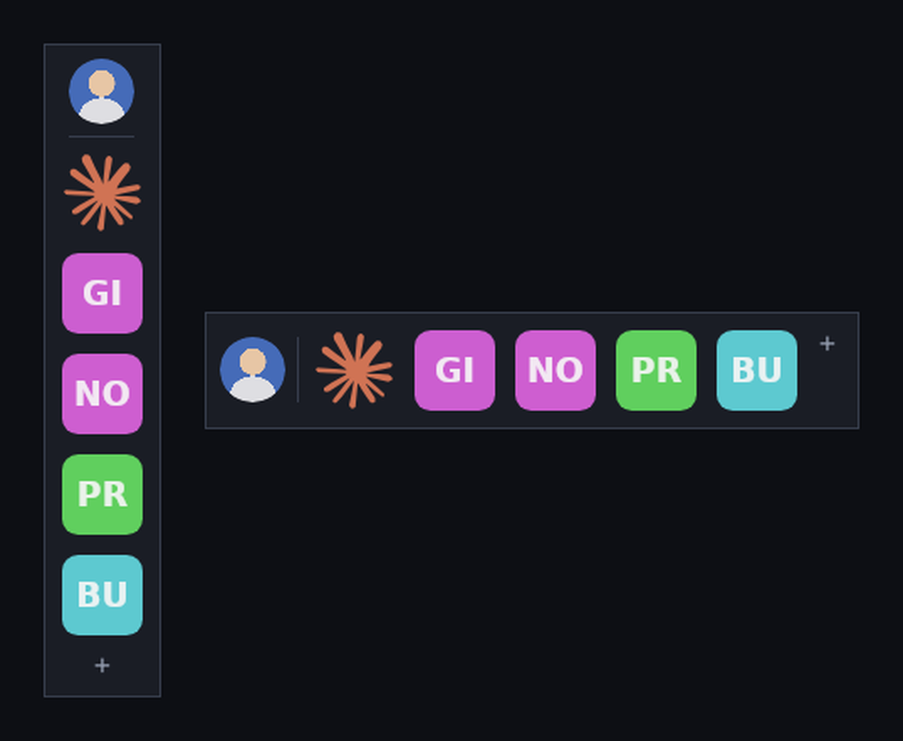

# DesktopDock

A small floating dock for Windows. It sits above the desktop and holds the apps,
folders, files and web pages you use most. Drag a browser tab or an `.exe` onto
it and it is pinned; click a tile to open it. Everything it remembers lives in
one plain text file next to the executable.



## Getting it running

Grab the code, then either:

- **Build a standalone exe** - double-click `publish.bat`. It produces
  `publish\DesktopDock.exe`, a single self-contained file (about 90 MB) that
  needs no .NET installed on the machine it runs on. Put it wherever you like
  and start it. `publish.bat small` builds a ~3 MB exe instead, for machines
  that already have the .NET 8 runtime.
- **Just run it** - double-click `run.bat`.

Both need the [.NET 8 SDK](https://dotnet.microsoft.com/download) on the machine
you build on.

## Using it

| What you want | How |
| --- | --- |
| Pin a web page | Drag the tab out of Chrome, Edge or Firefox and drop it on the dock |
| Pin an app | Drag an `.exe`, a shortcut or a Start-menu tile onto the dock |
| Pin a folder or file | Drag it in from Explorer |
| Pin what you just copied | Press **Ctrl+V** over the dock |
| Open something | Left-click its tile |
| Reorder | Drag a tile along the dock |
| Move the dock | Drag any empty part of it, or the profile picture |
| Rename, re-icon, remove | Right-click a tile |
| Your picture | Click the round avatar, or right-click the dock and choose *Set your picture…* |
| Everything else | Right-click the dock, or click **+** |

The dock menu also holds orientation (vertical or horizontal), icon size,
opacity, name labels, always-on-top, lock position, *Start with Windows*, and
quit.

Icons look after themselves: the real Windows icon for an app, folder or
document; the site's own favicon for a link (downloaded once, cached in
`icons\`); a thumbnail for an image file; and a coloured initials tile when
nothing better exists. *Change icon…* overrides any of them.

## Where your data lives

In **`pins.txt`**, beside the executable - no registry keys, no `AppData`,
nothing hidden. Copy the folder to a USB stick and the dock goes with you. The
file is meant to be readable and editable; after editing by hand, choose
*Reload pins.txt* from the menu.

```ini
[settings]
x = 1180
y = 220
orientation = vertical
icon_size = 48
opacity = 0.96
always_on_top = true
locked = false
show_labels = false
fetch_favicons = true
profile_pic = C:\Users\me\Pictures\me.jpg
profile_name = Michael

[pins]
link | Claude | https://claude.ai |
app | Notepad | C:\Windows\notepad.exe |
folder | Projects | C:\Users\me\Projects |
file | Budget | C:\Users\me\budget.xlsx |
```

Each pin is `type | label | target | icon`, where `type` is `app`, `file`,
`folder` or `link`, and `icon` is an optional path to a custom image. Only `|`,
`%` and line breaks are escaped inside a field (as `%7C`, `%25`, `%0A`), so
Windows paths read exactly as they are. Saves go through a temporary file, so an
interrupted write cannot leave you with a truncated dock.

## The code

```
src/DesktopDock.Core/    no UI, all unit tested
  Pin.cs                 one dock item and its text representation
  DockData.cs            settings and the pin list
  PinStore.cs            reading and writing pins.txt
  DropParser.cs          turning a drop - tab, file, folder, .url, text - into pins
src/DesktopDock/         the Avalonia application
  DockWindow.cs          the dock: layout, drag and drop, gestures, menus
  IconFactory.cs         initials tiles, thumbnails, avatars
  FaviconService.cs      fetching and caching site icons
  WindowsIcons.cs        shell icons through SHGetFileInfo
  ShellActions.cs        launching, Explorer, autostart
tests/DesktopDock.Tests/ run with test.bat, or dotnet run --project tests/DesktopDock.Tests
```

Built on [Avalonia](https://avaloniaui.net/), so the same code also builds and
runs on Linux and macOS. The Windows-only parts (shell icons, *Start with
Windows*, Explorer) are guarded and simply do nothing elsewhere.

Nothing is sent anywhere. The only network traffic is favicon downloads, which
*Fetch site icons* turns off.

If a drop ever does not register, start the dock with `DESKTOPDOCK_TRACE=1` set
and it will print what each drop carried.
